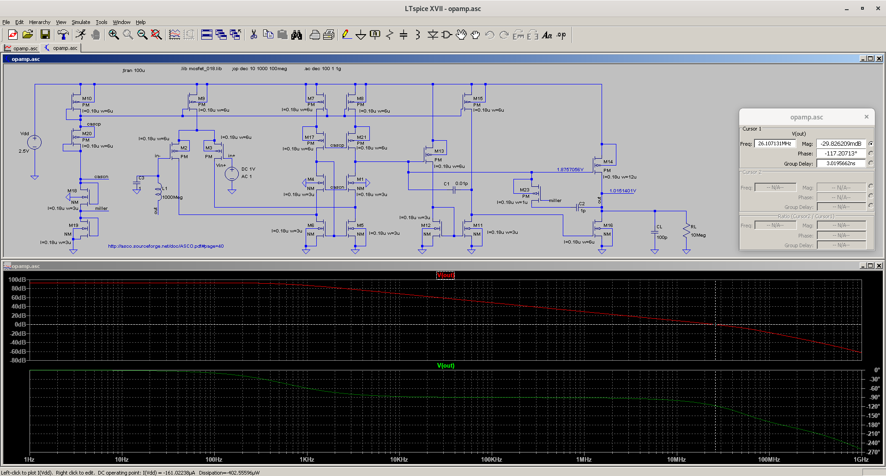

# opamp
An opamp based on positive frequency compensation topology

Measurements are done using output load capacitance CL of 100 pF 
and resistance RL of 10 Meg Ω

Power dissipation: 403 uW

Gain: 93 dB

Unity-Gain Bandwidth: 26 MHz

Phase Margin: 63 degrees

Settling Time: 63.14 ns

TODO: CMRR, ICMR, PSRR, Output Swing

Credit: [Joao Ramos thesis](http://asco.sourceforge.net/doc/phd_jramos.pdf) and eevblog forum
